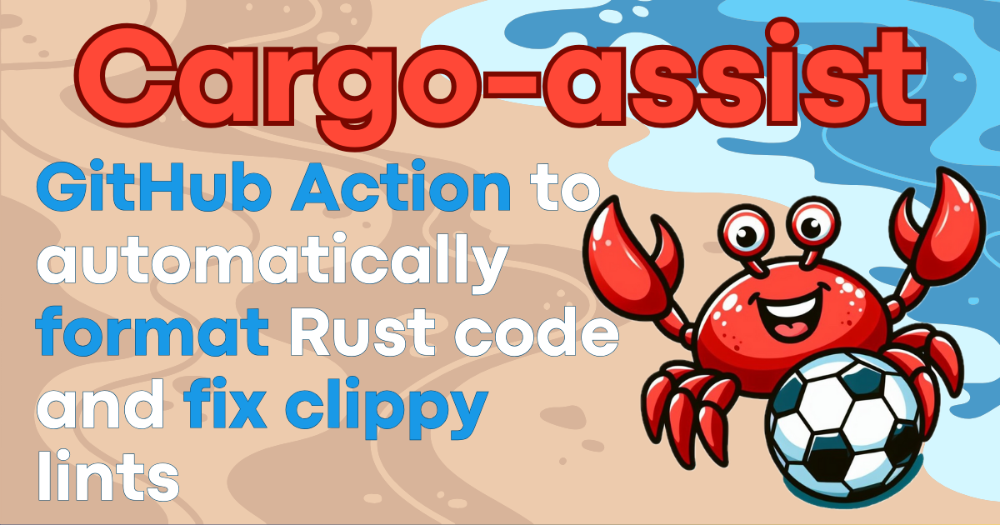
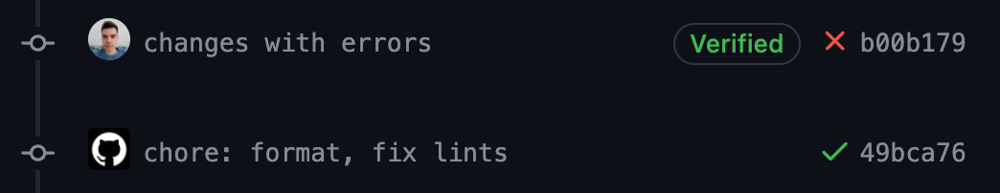
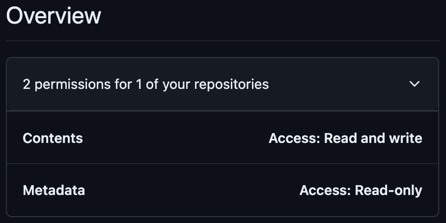

How many times do you have to run `cargo fmt` or `cargo clippy --fix` manually because of a failed CI check?

Well, you don't have to anymore! The *cargo-assist* GitHub action formats your code and fixes many clippy warnings for you!

> [!NOTE]
> The *cargo-assist* GitHub action runs `cargo fmt --all` and `cargo clippy --all-targets --all-features --workspace --fix` on every commit,
> and then commits and pushes the changes to the branch.



## Usage

Add the *cargo-assist* workflow file under the `.github/workflows` directory. For example `.github/workflows/cargo-assist.yml`:

```yaml
name: Cargo assist

permissions:
  contents: write

on:
  push:

jobs:
  cargo-assist:
    name: Cargo assist
    runs-on: ubuntu-latest
    steps:
      - name: Checkout repository
        uses: actions/checkout@v4
      - name: Install Rust toolchain
        uses: dtolnay/rust-toolchain@stable
      - name: Run Cargo assist
        uses: MarcoIeni/cargo-assist@v0.1
        env:
          GITHUB_TOKEN: ${{ secrets.GITHUB_TOKEN }}
```

## Inputs

TODO

## Run other commands

If you want to run other commands before running *cargo-assist*, you can do the following:

```yaml
jobs:
  cargo-assist:
    name: Cargo assist
    runs-on: ubuntu-latest
    steps:
      - name: Checkout repository
        uses: actions/checkout@v4
      - name: Install Rust toolchain
        uses: dtolnay/rust-toolchain@stable
      - name: My custom step
        run: cargo update
      - name: Run Cargo assist
        uses: MarcoIeni/cargo-assist@v0.1
        with:
          # Needed because after the custom step, the repository
          # contains uncommited changes (Cargo.lock in this case).
          clippy_allow_dirty: true
        env:
          GITHUB_TOKEN: ${{ secrets.GITHUB_TOKEN }}
```

## Default GitHub token

GitHub Actions using the default
[`GITHUB_TOKEN`](https://docs.github.com/en/actions/security-guides/automatic-token-authentication)
cannot trigger other workflow runs.

Therefore, your `on: pull_request` or `on: push` workflows won't run on
*cargo-assist* commits if you don't specify a token in the `actions/checkout` step.

You can learn more in the GitHub
[docs](https://docs.github.com/en/actions/using-workflows/triggering-a-workflow#triggering-a-workflow-from-a-workflow).

## How to trigger further workflow runs

If you want to run CI checks on *cargo-assist* commits,
you need to use one of the following methods.

### Trigger workflow manually

To run `on: pull_request` workflows you can manually close and reopen the release pull request.

### Use a Personal Access Token

Use a [Personal Access Token (PAT)](https://docs.github.com/en/github/authenticating-to-github/creating-a-personal-access-token)
created on an account with write access to the repository.
This is the standard method
[recommended by GitHub](https://docs.github.com/en/actions/using-workflows/triggering-a-workflow#triggering-a-workflow-from-a-workflow).

Note that the account that owns the PAT will be the author of the commit.
If you don't want *cargo-assist* to commit with your account,
consider creating a
[machine user](https://docs.github.com/en/get-started/learning-about-github/types-of-github-accounts#personal-accounts).

Create the PAT, choosing one of the two types:

- [Fine-grained](https://docs.github.com/en/authentication/keeping-your-account-and-data-secure/creating-a-personal-access-token#fine-grained-personal-access-tokens):
  more secure because you can select the repositories where the PAT can be used.
  Follow [these](https://docs.github.com/en/authentication/keeping-your-account-and-data-secure/managing-your-personal-access-tokens#creating-a-fine-grained-personal-access-token)
  instructions, giving the PAT the following permissions:
  - Select the repositories where you want to use the PAT, to give *cargo-assist* write access:
    
  - Under "Repository permissions", assign "Contents" read and write permissions:
    
- [Classic](https://docs.github.com/en/authentication/keeping-your-account-and-data-secure/creating-a-personal-access-token#personal-access-tokens-classic):
  less secure because you can't scope it to a single repository.
  Follow [these](https://docs.github.com/en/authentication/keeping-your-account-and-data-secure/managing-your-personal-access-tokens#creating-a-personal-access-token-classic)
  instructions, giving the PAT `repo` permissions:
  

Once you generated your token, save it in the
[secrets](https://docs.github.com/en/actions/security-guides/encrypted-secrets),
and pass it to both the `actions/checkout` and *cargo-assist* steps:

```yaml
jobs:
  cargo-assist:
    name: Cargo assist
    runs-on: ubuntu-latest
    steps:
      - name: Checkout repository
        uses: actions/checkout@v4
        with:
          token: ${{ secrets.CARGO_ASSIST_TOKEN }} # <-- PAT secret name
      - name: Install Rust toolchain
        uses: dtolnay/rust-toolchain@stable
      - name: Run Cargo fmt bot
        uses: MarcoIeni/cargo-assist@v0.1
        env:
          GITHUB_TOKEN: ${{ secrets.GITHUB_TOKEN }} # <-- to be the author of the commit,
                                                    #     set the PAT secret name here, too
```

### Use a GitHub App

Generate a GitHub token with a GitHub App.
With this approach, the GitHub App will be the author of commits.

Here's how to use a GitHub App to generate a GitHub token:

1. Create a minimal [GitHub App](https://docs.github.com/en/developers/apps/creating-a-github-app),
   setting the following fields:
   - Set `GitHub App name`.
   - Set `Homepage URL` to anything you like, such as your GitHub profile page.
   - Uncheck `Active` under `Webhook`. You do not need to enter a `Webhook URL`.
   - Under `Repository permissions: Contents` select `Access: Read & write`.
   - (Optional) Under `Where can this GitHub App be installed?` select `Only on this account`

2. Create a Private key from the App settings page and store it securely.

3. Install the App on the repositories where you want to run *cargo-assist*.

4. Store the GitHub App ID, and the private
   key you created in step 2 in GitHub
   [secrets](https://docs.github.com/en/actions/security-guides/encrypted-secrets).
   E.g. `APP_ID`, `APP_PRIVATE_KEY`.

5. Use
   [actions/create-github-app-token](https://github.com/actions/create-github-app-token)
   to generate a token from the GitHub Action:

   ```yaml
   steps:
     # Generating a GitHub token, so that commits created by
     # the cargo-assist can trigger actions workflows.
     - name: Generate GitHub token
       uses: actions/create-github-app-token@v1
       id: generate-token
       with:
         app-id: ${{ secrets.APP_ID }} # <-- GitHub App ID secret name
         private-key: ${{ secrets.APP_PRIVATE_KEY }} # <-- GitHub App private key secret name
     - name: Checkout repository
       uses: actions/checkout@v4
       with:
         token: ${{ steps.generate-token.outputs.token }}
     - name: Install Rust toolchain
       uses: dtolnay/rust-toolchain@stable
     - name: Run Cargo assist
       uses: MarcoIeni/cargo-assist@v0.1
       env:
         GITHUB_TOKEN: ${{ steps.generate-token.outputs.token }}
   ```

## 💖 Users

Here you can find the public repositories using the cargo-assist GitHub action in CI:

- [GitHub search](https://github.com/search?type=code&q=path%3A*.yml+OR+path%3A*.yaml+MarcoIeni%2Fcargo-assist)
- [Dependency graph](https://github.com/MarcoIeni/cargo-assist/network/dependents)

<br>

<sup>
Licensed under either of <a href="LICENSE-APACHE">Apache License, Version 2.0</a>
or <a href="LICENSE-MIT">MIT license</a> at your option.
</sup>

<br>

<sub>
Unless you explicitly state otherwise, any contribution intentionally submitted
for inclusion in the work by you, as defined in the Apache-2.0 license, shall be
dual licensed as above, without any additional terms or conditions.
</sub>
